

<h1> 🌰Site Expositivo da Nósz🌰 </h1>

> 
 Visualize previamente as principais secções do site que propõe expor e informatizar toda o conceito, ideais e capacidades de transformar o reaproveitamento de alimentos 

<h2> ♻ Página principal </h2>

<h3> 🏠Início </h3>

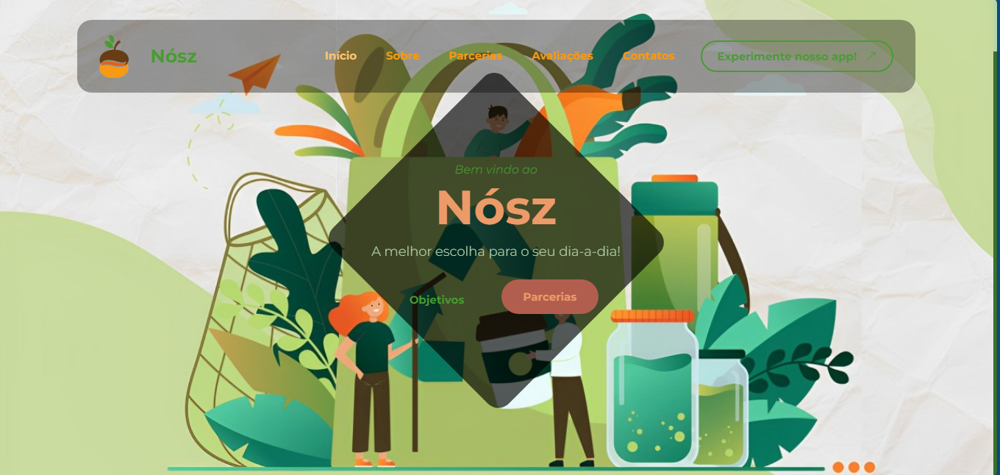
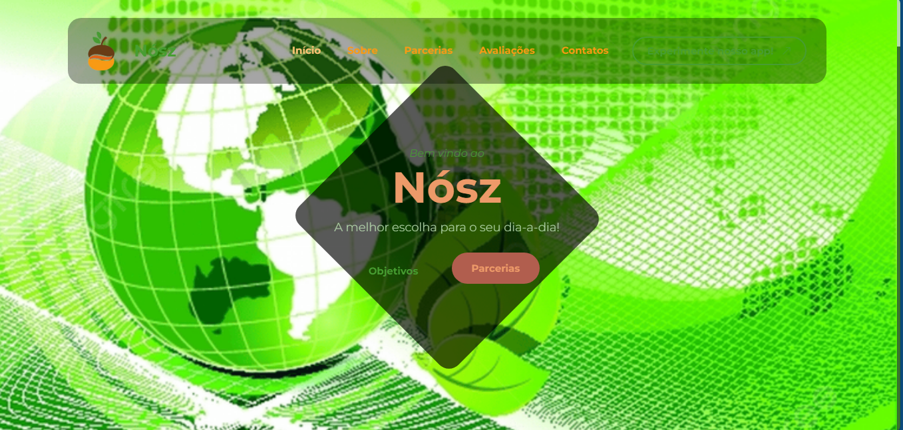
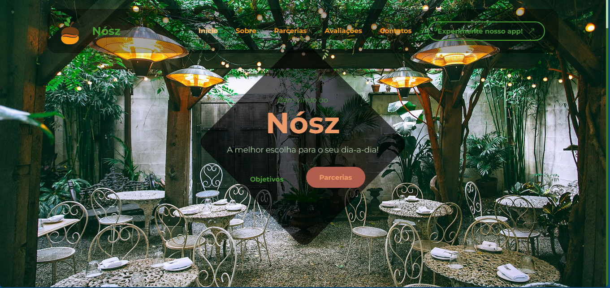

<h3> 💡Sobre </h3>
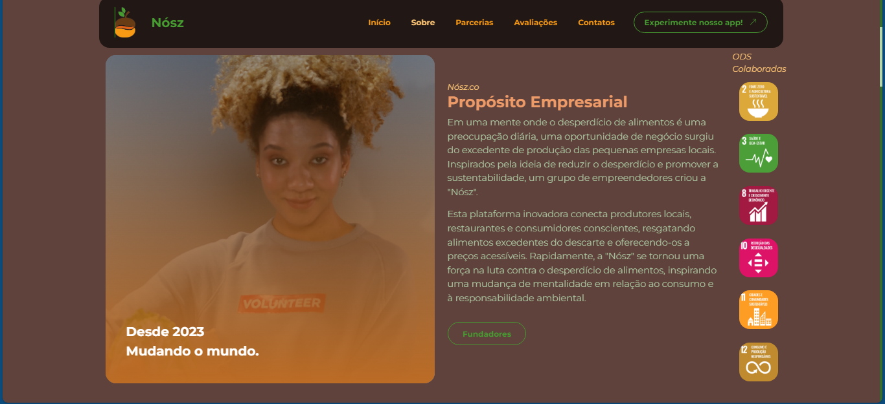

<h3> 👨🏻‍💻Fundadores </h3>
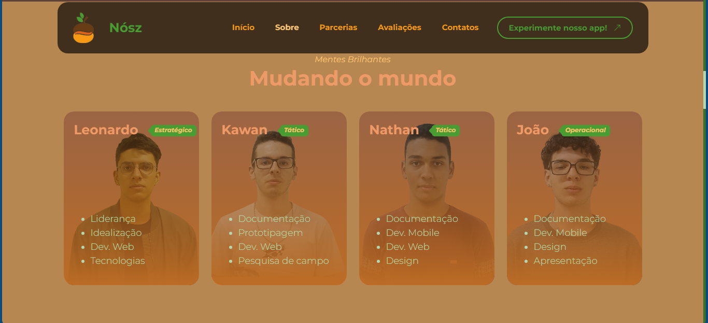

<h3> 🤝🏻Parcerias </h3>
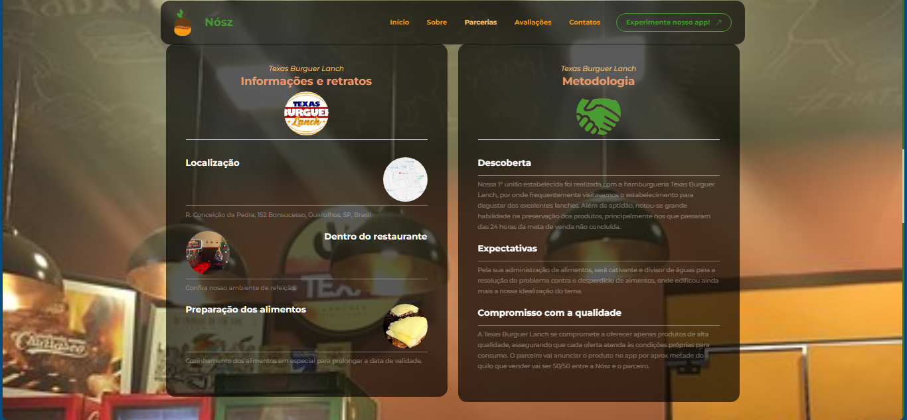

<h3> ⭐Avaliações </h3>

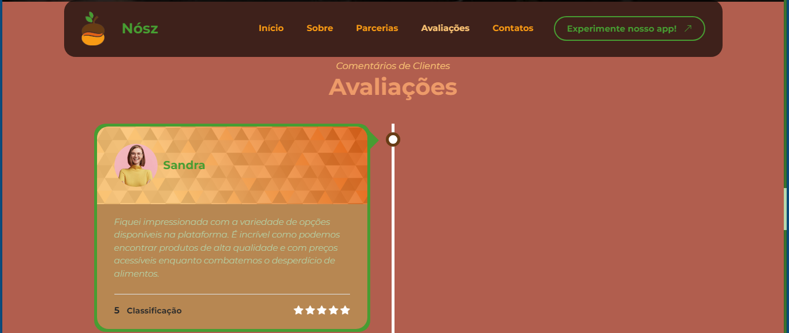
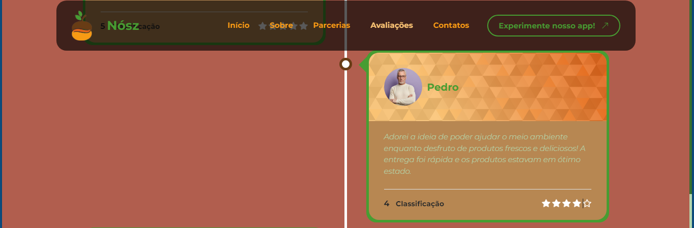
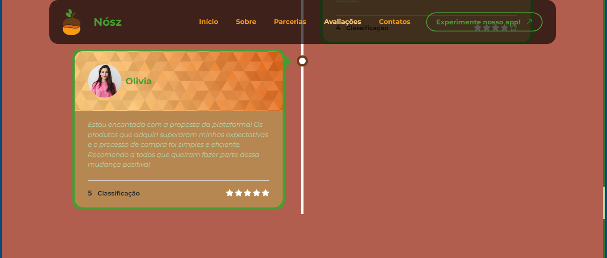

<h3> 📬Rodapé </h3>

<h2> 📑Página de Cadastro e Download do App </h2>
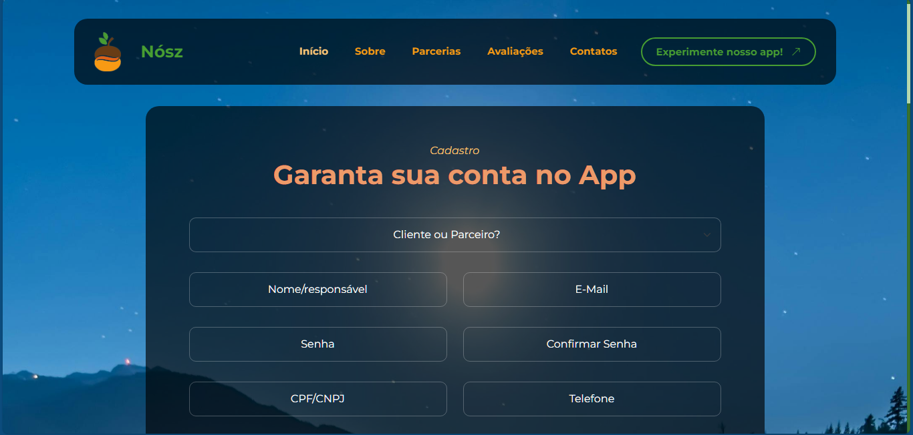

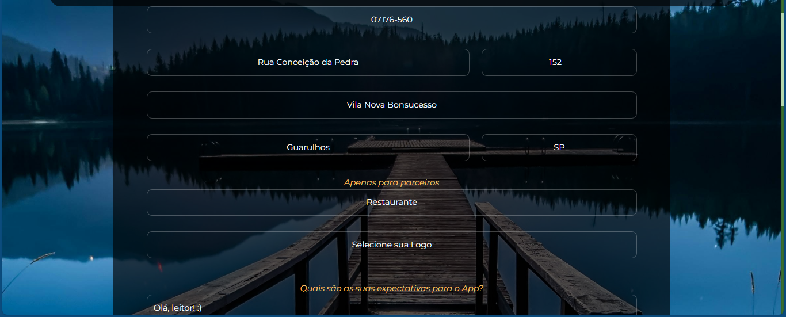
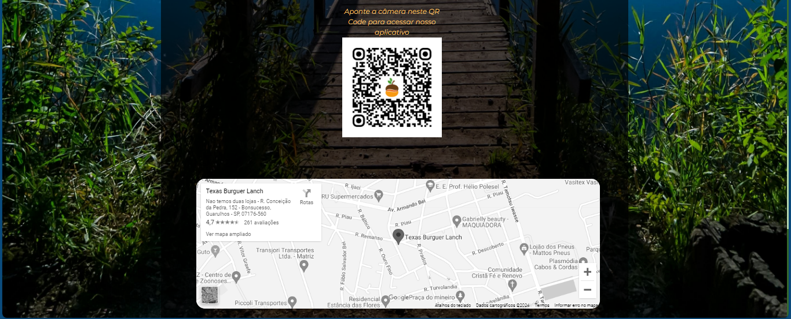

<h2> 📲Utilizando o mesmo cadastro do site para o app </h2>
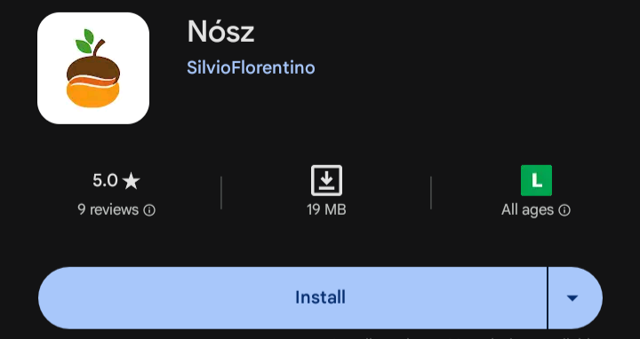
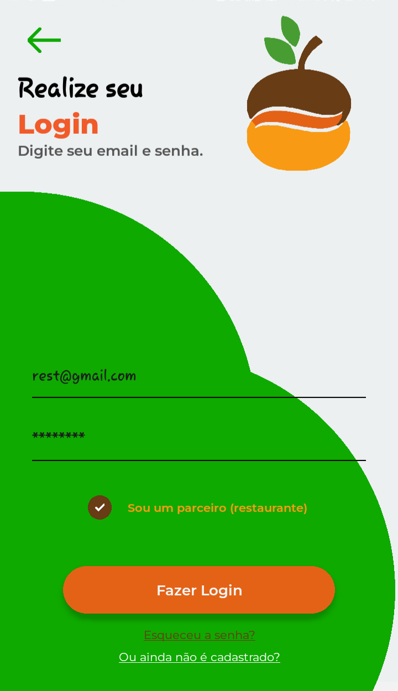
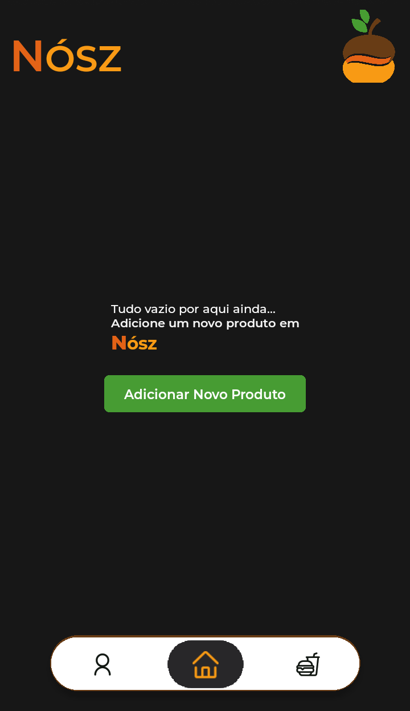
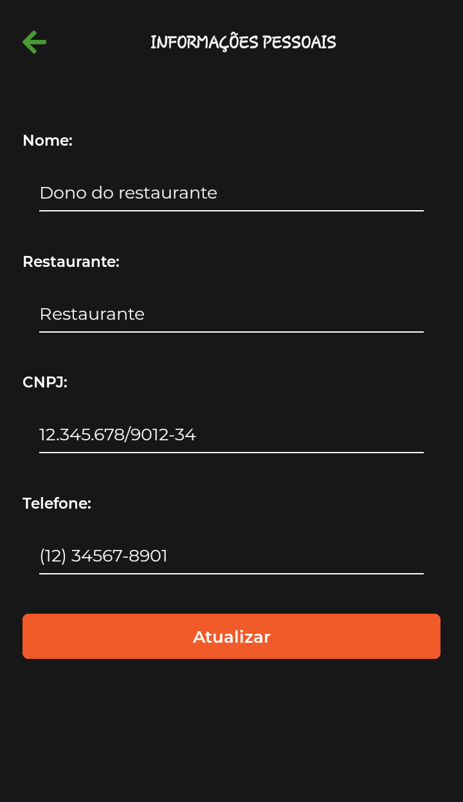
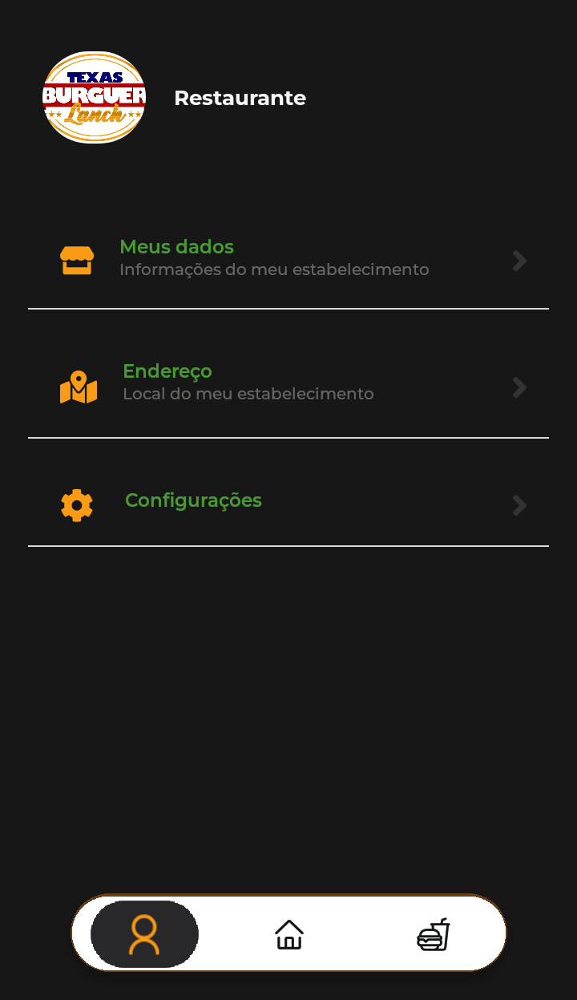
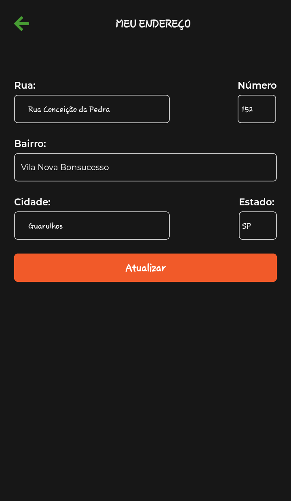
